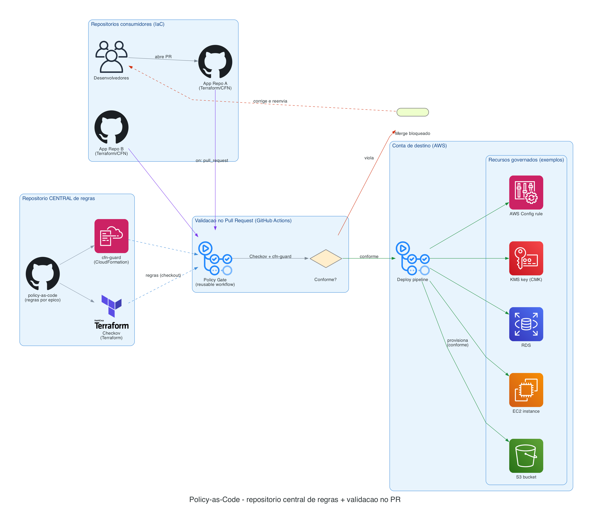

# Policy-as-Code — Validação preventiva de IaC

Repositório **central** de regras de _Policy-as-Code_ para validar Infraestrutura como Código **antes do merge** (gate preventivo no Pull/Merge Request), usando:

- **[Checkov](https://www.checkov.io/)** → Terraform (regras custom em YAML)
- **[AWS CloudFormation Guard (cfn-guard)](https://github.com/aws-cloudformation/cloudformation-guard)** → CloudFormation

A validação roda via **GitHub Actions no evento `pull_request`** (não na pipeline de deploy), de modo que mudanças não conformes são barradas antes de chegar à branch de deploy.

> Regra de exemplo incluída: **um bucket S3 deve ser criptografado com uma KMS Customer Managed Key (CMK)** — rejeita SSE-S3 (AES256) e falta de `KMSMasterKeyID`.

> 📘 **Implementação no GitHub + troubleshooting:** veja [`docs/pipeline-implementation.md`](docs/pipeline-implementation.md).

---

## Arquitetura / Fluxo

O repositório central concentra as regras; os repositórios de aplicação **consomem** essas regras na validação do Pull Request (via workflow reutilizável). Não conforme → merge bloqueado; conforme → merge e deploy.



> Diagrama gerado por `img/architecture.py` (biblioteca [`diagrams`](https://diagrams.mingrammer.com/) + Graphviz). Para regerar: `python img/architecture.py`.

---

## Estrutura

```
policy-as-code/
├── checkov/                       # regras Checkov (Terraform), organizadas por épico
│   ├── iam/
│   ├── detective-controls/
│   ├── infra-security/
│   ├── data-protection/
│   │   └── s3_kms_cmk.yaml        #  [id: CKV2_PAC_1] S3 exige KMS CMK
│   └── incident-response/
├── guard-rules/                   # regras cfn-guard (CloudFormation), por épico
│   ├── iam/
│   ├── detective-controls/
│   ├── infra-security/
│   ├── data-protection/
│   │   └── s3_kms_cmk.guard
│   └── incident-response/
├── examples/
│   ├── terraform/{compliant,noncompliant}/main.tf
│   └── cloudformation/{compliant,noncompliant}.yaml
├── scripts/
│   ├── test-policies.sh           # auto-teste (compliant passa / noncompliant falha)
│   └── run-checks.sh              # roda as checagens em diretórios informados
└── .github/workflows/
    ├── policy-as-code.yml         # auto-teste das regras (no PR deste repo)
    └── reusable-policy-scan.yml   # workflow REUTILIZÁVEL p/ repos consumidores
```

As regras são organizadas por **épico de segurança**: `iam`, `detective-controls`, `infra-security`, `data-protection`, `incident-response`. As ferramentas recursam nos subdiretórios automaticamente — `checkov --external-checks-dir checkov` carrega todas as regras dos épicos, e `cfn-guard validate -r guard-rules` idem.

---

## Como funciona o gate "antes do PR/MR"

1. O repositório **consumidor** adiciona um workflow que chama o workflow reutilizável no evento `pull_request`.
2. Ao abrir/atualizar um PR, o scan roda; se houver violação, o job **falha**.
3. Uma **branch protection rule** marca esse check como **required** → o PR não pode ser mergeado enquanto não estiver conforme. Esse é o ponto preventivo.

### No repositório consumidor (`.github/workflows/policy-gate.yml`)

```yaml
name: Policy Gate
on: pull_request
jobs:
  policy:
    uses: <ORG>/policy-as-code/.github/workflows/reusable-policy-scan.yml@main
    with:
      terraform_dir: "."
      cloudformation_dir: "cfn"   # opcional; vazio = pula CloudFormation
      policy_repo: "<ORG>/policy-as-code"
      policy_ref: "main"
```

Depois, em **Settings → Branches → Branch protection rules**, marque o check `policy-scan` como _Required_.

> Alternativa/adicional: **pre-commit hooks** (Checkov e cfn-guard suportam) para feedback ainda na máquina do desenvolvedor.

---

## Uso local

Pré-requisitos: `pip install checkov` e o [cfn-guard](https://github.com/aws-cloudformation/cloudformation-guard#installation).

```bash
# Auto-teste das regras deste repo (compliant passa, noncompliant falha):
bash scripts/test-policies.sh

# Rodar as checagens contra seus diretórios:
scripts/run-checks.sh ./infra ./cfn
```

---

## A regra de exemplo (S3 exige KMS CMK)

- **Checkov** (`checkov/s3_kms_cmk.yaml`, id `CKV2_PAC_1`): no recurso `aws_s3_bucket_server_side_encryption_configuration`, exige `sse_algorithm = "aws:kms"` e `kms_master_key_id` presente.
  Para também rejeitar a chave gerenciada pela AWS (`alias/aws/s3`), acrescente uma condição `not_starting_with: "alias/aws/"`.
- **cfn-guard** (`guard-rules/s3_kms_cmk.guard`): em `AWS::S3::Bucket`, exige `BucketEncryption` com `SSEAlgorithm == 'aws:kms'` e `KMSMasterKeyID` presente.

---

## Adicionando novas regras

- **Terraform/Checkov:** crie um novo `.yaml` na pasta do épico correspondente (ex.: `checkov/iam/`, `checkov/data-protection/`) com um `id` único (padrão `CKV2_PAC_<n>`), e adicione exemplos em `examples/terraform/`.
- **CloudFormation/cfn-guard:** crie um novo `.guard` na pasta do épico em `guard-rules/<epico>/` e exemplos em `examples/cloudformation/`.
- Épicos disponíveis: `iam`, `detective-controls`, `infra-security`, `data-protection`, `incident-response`.
- Atualize `scripts/test-policies.sh` para cobrir a nova regra.

---

## Referências AWS

- AWS Prescriptive Guidance — [Implement centralized custom Checkov scanning](https://docs.aws.amazon.com/prescriptive-guidance/latest/patterns/centralized-custom-checkov-scanning.html)
- [AWS CloudFormation Guard](https://github.com/aws-cloudformation/cloudformation-guard) · [Rules Registry (CIS/PCI/…)](https://github.com/aws-cloudformation/aws-guard-rules-registry)
- Blog — [Extend your pre-commit hooks with AWS CloudFormation Guard](https://aws.amazon.com/blogs/security/extend-your-pre-commit-hooks-with-aws-cloudformation-guard/)
- Blog — [Continuous Compliance Workflow for IaC (Part 2)](https://aws.amazon.com/blogs/devops/continuous-compliance-workflow-for-infrastructure-as-code-part-2/)
